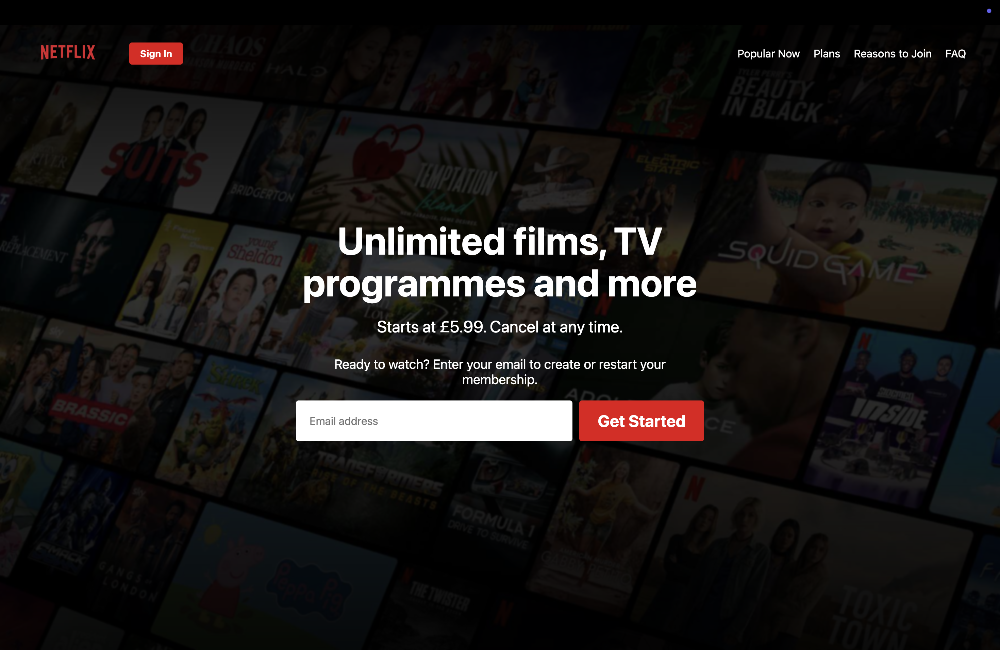

# Netflix Clone Project

A responsive Netflix landing page clone built with HTML and CSS.



## Features
- Netflix-like UI with blurred background
- Responsive design (mobile, tablet, desktop)
- Email signup form
- Netflix color scheme and styling

## Technologies Used
- HTML5
- CSS3 (Flexbox, Media Queries)
- GitHub Pages (for deployment)

## How to Run
1. Clone the repository:
   ```bash
   git clone https://github.com/your-username/netflix-clone.git
   ```
2. Open `index.html` in your browser

## Live Demo
[View on GitHub Pages](https://your-username.github.io/netflix-clone/)

## Project Structure
```
netflix-clone/
├── index.html
├── index.css
├── README.md
└── images/
    ├── Netflix_Logo_PMS.png
    └── GB-en-20250324-TRIFECTA-perspective_ab8187c8-4ac6-4fbf-bbb7-8c119853ba14_small.jpg
```

## License
This project is licensed under the MIT License - see the [LICENSE](LICENSE) file for details.